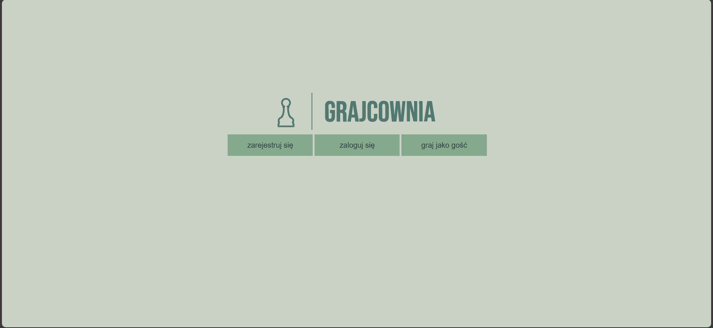
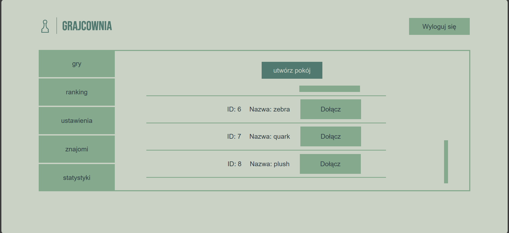
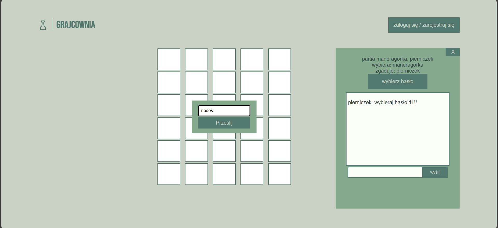
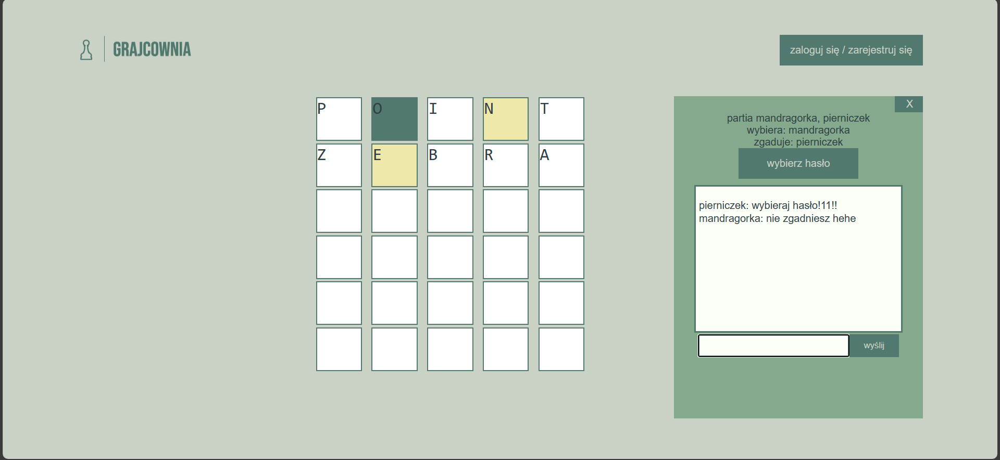
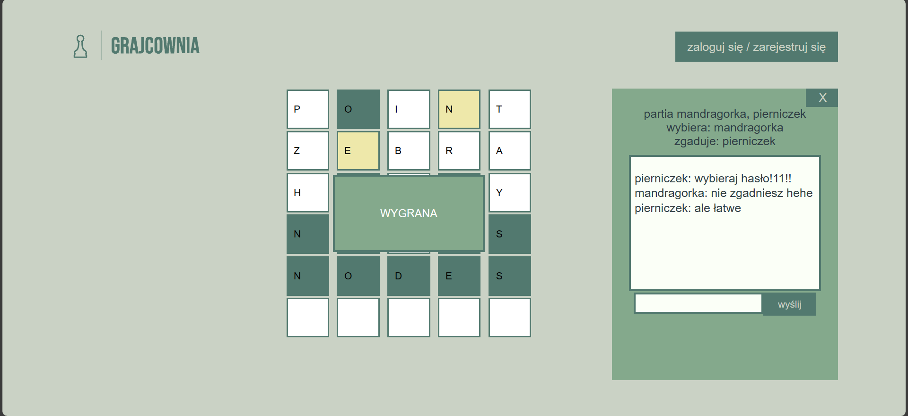
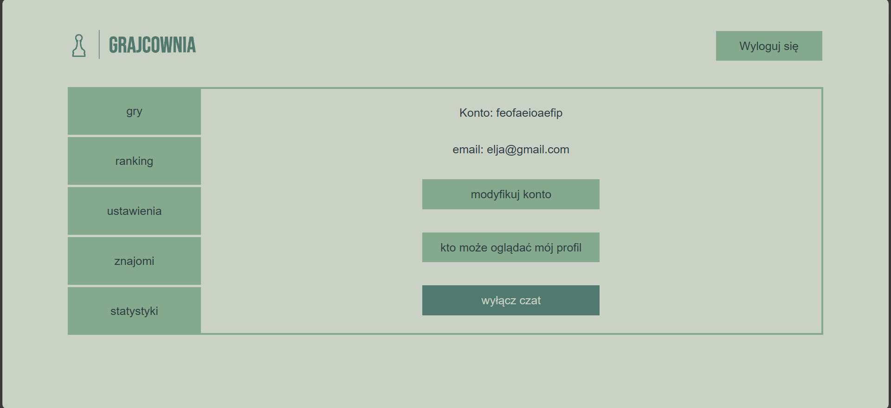

# Grajcownia
online games website created by anka335 and Jędrzej Kolski

# About Us
Grajcownia is a project created with the intention of providing online gaming enthusiasts a place, where they can enjoy real-time gameplay. Our platform is designed for user-friendliness and accessibility, allowing gamers to play various games and communicate with other gamers.

# Registration and Login
The platform offers the option of registration, enabling full access to its features, such as chat. For those who value privacy, there is also an option to play as a guest without creating an account.

# Game Rooms
Our platform allows users to create and join game rooms, where they can play with friends or other gamers.

# Games
Currently, it only provides wordle gameplay. There are two roles: guesser and selector, the guesser tries to guess the password and the selector is the one who sets it.

# Settings
Grajcownia platform allows users to customize their accounts through settings.

Grajcownia is my first big project that I've made frontend for. It's not SEO compliant, the design is not responsive for small devices and it requires from me a lot of changes, so I stopped working on it. Too many things have been done in a wrong way and for now I'm going to focus on something new and maybe in the future I will create Grajcownia from scratch. - anka335
